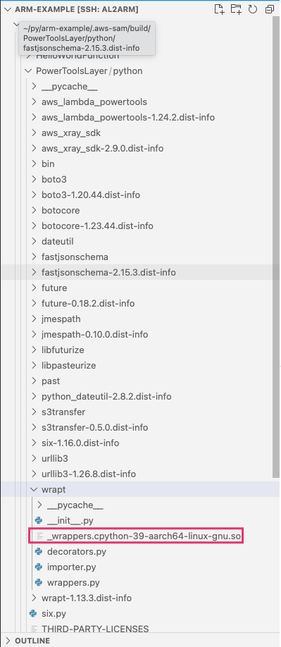

# arm-python-lambda-example
When building a SAM project that includes a dependency that includes a C extension and requires building from source, the build typically fails with an error such as:

```
Error: PythonPipBuilder:ResolveDependencies - {wrapt==1.13.1(sdist)}
```

In this case `pip wheel` will successfully compile the extension on Arm if setuptools is updated. However the way SAM then looks to package up the wheel, does not succeed currently. 

This example shows how to package dependencies that require compile from source into a Layer using a Makefile and pip. 

To try this out run the following commands:
```
pip install --upgrade pip setuptools
sam build
sam deploy --guided
```

Looking into the `.aws-sam` directory we can see that the wrapt wheel has been packaged with the C extension built. 
<p align="center">
  
</p>
